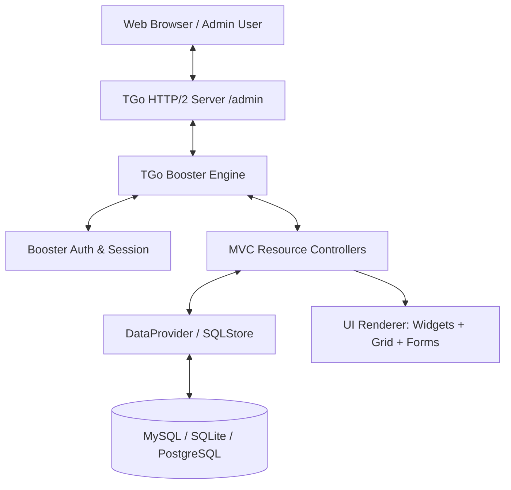

# ⚡ TGo Booster

> **Ultra-Fast Declarative Admin & CRUD Studio Engine for Go**  
> Framework panel administrasi enterprise modern dengan arsitektur MVC bersih, tema ganda (Dark & Light Mode), multi-database persistence, dan sistem kustomisasi tingkat lanjut (Widgets, Pre/Post HTML, Top & Row Actions).

[](https://golang.org)
[](https://github.com/tokalink/tgo)
[](#)
[](#)
[](LICENSE)

> 🚀 **Ingin membuat proyek baru berbasis TGo Booster?**  
> Baca panduan langkah-demi-langkah resmi di: **[Panduan Membuat Proyek Baru (New Project Guide)](docs/getting-started-new-project.md)**.

---

## 📑 Daftar Isi

- [1. Arsitektur & Filosofi Desain](#1-arsitektur--filosofi-desain)
- [2. Quick Start & Starter App](#2-quick-start--starter-app)
- [3. Sistem Tema Ganda & Aksen Skin](#3-sistem-tema-ganda--aksen-skin)
- [4. Dukungan Multi-Database (MySQL, SQLite, PgSQL)](#4-dukungan-multi-database-mysql-sqlite-pgsql)
- [5. Panduan Controller & Resource CRUD](#5-panduan-controller--resource-crud)
  - [Format Kolom Data Grid](#format-kolom-data-grid)
  - [Format Kontrol Input Form](#format-kontrol-input-form)
  - [Relasi Database Dinamis & LOV Modal Picker](#relasi-database-dinamis--lov-modal-picker)
- [6. Kustomisasi Tingkat Lanjut (Advanced Studio Features)](#6-kustomisasi-tingkat-lanjut-advanced-studio-features)
  - [Widget KPI Stat Cards](#a-widget-kpi-stat-cards-di-atas-modul)
  - [Dynamic Live Widget Provider](#b-dynamic-live-widget-provider)
  - [Custom Top Actions (Index Buttons)](#c-custom-top-actions-index-buttons)
  - [Custom Row Actions (Add Action)](#d-custom-row-actions-per-baris)
  - [Injeksi Pre/Post HTML (Tabel & Form)](#e-injeksi-prepost-html-tabel--form)
  - [Filter Tabs](#f-filter-tabs-segmented-controls)
- [7. Siklus Hook (Lifecycle Hooks)](#7-siklus-hook-lifecycle-hooks)
- [8. Autentikasi & Command Palette (Ctrl+K)](#8-autentikasi--command-palette-ctrlk)
- [9. Contoh Lengkap Controller MVC](#9-contoh-lengkap-controller-mvc)

---

## 1. Arsitektur & Filosofi Desain

TGo Booster dirancang khusus untuk ekosistem Go modern dengan prinsip:
1. **Zero-Alloc Performance**: Rata-rata response time **~0.38 ms TTFB**, didukung embedded view template engine dan self-hosted CSS (tanpa CDN eksternal).
2. **Pola MVC Murni**: Memisahkan Controller deklaratif (`booster.Controller`), Model/Repository (`DataProvider`), dan View (`Embedded HTML5/CSS3`).
3. **Type-Safe Fluent API**: Tidak lagi menggunakan *loosely-typed associative array* PHP (seperti pada CRUDBooster lama) yang rawan *runtime typo*. Seluruh kolom, form, aksi, dan widget memiliki static typing Go yang aman.



---

## 2. Quick Start & Instant Project Creator

### 🚀 Cara 1: Buat Proyek Baru Otomatis (1 Perintah — Bebas Error)
Gunakan CLI bawaan untuk membuat struktur proyek lengkap siap jalan dalam 3 detik:

```powershell
# Windows PowerShell:
.\new-project.ps1 portal-app

# Atau via booster CLI:
.\booster.exe new portal-app

# Masuk dan jalankan:
cd ..\portal-app
go run main.go
# Atau dengan live reload:
air
```

*CLI otomatis mendeteksi port bebas, menyinkronkan module path, membuat folder database SQLite otomatis, dan memvalidasi kompilasi zero-error.*

### 🛠️ Cara 2: Menjalankan Starter Application Bawaan
```bash
cd tgo-booster
go run starter/main.go
```

Buka browser di **`http://localhost:8080/admin/login`**:
- **Default Email**: `admin@tgo.io`
- **Default Password**: `admin123` *(tersedia tombol 1-click Quick Demo Access)*

### ⚡ Membuat Controller CRUD Baru
Di dalam proyek Anda, generate controller deklaratif dalam 1 detik:
```bash
booster make:controller Products
```
File `app/controllers/admin_products_controller.go` akan dibuat dengan konfigurasi tabel, kolom, form input, dan model store otomatis.

---

## 3. Sistem Tema Ganda & Aksen Skin

TGo Booster dilengkapi sistem tema enterprise yang bebas kedipan (*Zero-FOUC*):

1. **Dark Mode (Default)**: Tampilan *Obsidian Glass* bergaya Linear & Supabase dengan aksen Sky Cyan dan depth gradient lembut.
2. **Light Mode**: Tampilan *Clean Slate* bergaya Vercel / Catalyst dengan kartu putih kontras tinggi, tipografi gelap `#0f172a`, dan badge pastel elegan.
3. **Color Accent Skins**:
   - **Obsidian Glass (Default)**: Cyan/Sky Blue `#38bdf8`
   - **Midnight Indigo Blue**: Deep Indigo `#6366f1`
   - **Emerald Corporate**: Green `#10b981`
   - **Royal Amethyst**: Purple `#a855f7`

### Cara Beralih Tema:
- **Tombol Cepat Topbar / Login**: Klik tombol toggle Matahari / Bulan (`☀️ / 🌙`).
- **Menu Settings (`/admin/settings`)**: Pilih varian tema di dropdown **Default Theme Skin** untuk melihat perubahan warna secara realtime dan tersimpan permanen di `localStorage`.

---

## 4. Dukungan Multi-Database (MySQL, SQLite, PgSQL)

Konfigurasi database sepenuhnya diatur melalui berkas `.env`:

```env
# 1. MySQL (Default Enterprise)
DB_CONNECTION=mysql
DB_HOST=127.0.0.1
DB_PORT=3306
DB_DATABASE=tgo_booster
DB_USERNAME=root
DB_PASSWORD=

# 2. SQLite (Tanpa Server / Local Dev)
# DB_CONNECTION=sqlite
# DB_DATABASE=data/tgo_booster.db

# 3. PostgreSQL
# DB_CONNECTION=pgsql
# DB_HOST=127.0.0.1
# DB_PORT=5432
# DB_DATABASE=tgo_booster
# DB_USERNAME=postgres
# DB_PASSWORD=secret
# DB_SSLMODE=disable
```

*Jika database SQL belum aktif, TGo Booster secara otomatis menggunakan **In-Memory Store Fallback** sehingga aplikasi starter selalu dapat dijalankan langsung.*

---

## 5. Panduan Controller & Resource CRUD

Setiap modul admin didefinisikan sebagai controller deklaratif:

```go
func NewAdminProductController() *booster.Controller {
    ctrl := &booster.Controller{
        Title:        "Products",
        Table:        "products",
        Icon:         `<svg ...></svg>`,
        DataProvider: models.ProductRepo,
    }

    // 1. Definisikan Kolom Tabel
    ctrl.
        AddCol("ID", "id", booster.ColText, false, true).
        AddCol("Product Name", "name", booster.ColText, true, true).
        AddCol("Price", "price", booster.ColMoney, false, true).
        AddCol("Stock", "stock", booster.ColNumber, false, true).
        AddCol("Status", "status", booster.ColBadge, false, false)

    // 2. Definisikan Kolom Form Input
    ctrl.
        AddForm("Product Name", "name", booster.InputText, true, "Enter product name...").
        AddForm("Price", "price", booster.InputMoney, true, "Rp 0").
        AddForm("Stock", "stock", booster.InputNumber, true, "10").
        AddSelect("Status", "status", true, "Select status...",
            booster.Option{Value: "Active", Label: "Active"},
            booster.Option{Value: "Processing", Label: "Processing"},
            booster.Option{Value: "Inactive", Label: "Inactive"},
        ).
        AddForm("Description", "description", booster.InputWYSIWYG, false, "Product details...")

    return ctrl
}
```

### Format Kolom Data Grid
| Tipe Kolom | Konstanta | Contoh Render |
|---|---|---|
| Teks Biasa | `booster.ColText` | Teks standar dengan text-truncate |
| Mata Uang | `booster.ColMoney` | Tipografi monospaced bernuansa cyan/aksen |
| Status Badge | `booster.ColBadge` | Badge berwarna dengan dot status (Active, Pending, dll) |
| Angka | `booster.ColNumber` | Perataan angka & format integer |
| Email | `booster.ColEmail` | Link `mailto:` yang dapat diklik |
| Gambar | `booster.ColImage` | Thumbnail avatar / preview gambar |
| Tanggal & Waktu | `booster.ColDateTime` | Format tanggal & jam terstandarisasi |

### Format Kontrol Input Form
| Tipe Input | Konstanta | Keterangan |
|---|---|---|
| Text Field | `booster.InputText` | Input baris tunggal |
| Number | `booster.InputNumber` | Input nilai numerik |
| Money | `booster.InputMoney` | Input nilai harga / nominal |
| Password | `booster.InputPassword` | Input tersamar (otomatis di-bypass saat edit jika kosong) |
| Dropdown | `booster.InputSelect` | Pilihan select dengan opsi statis atau dinamis |
| Select2 Searchable | `booster.InputSelect2` | Pilihan select dengan pencarian client-side |
| Radio Buttons | `booster.InputRadio` | Pilihan radio horizontal dari data statis/tabel |
| LOV Modal Picker | `booster.InputLOV` | Komponen popup modal cari & pilih data relasi |
| Textarea | `booster.InputTextarea` | Area teks multi-baris |
| Rich Editor | `booster.InputWYSIWYG` | Input teks kaya (HTML formatted) |
| Date Picker | `booster.InputDate` | Kalender pemilihan tanggal |

### Relasi Database Dinamis & LOV Modal Picker

Sama seperti properti `datatable="table,label"` di CRUDBooster PHP lama, TGo Booster menyediakan metode deklaratif type-safe tanpa perlu me-looping atau meng-hardcode opsi manual:

```go
// 1. Dropdown Dinamis dari Database ("table,label[,key]")
ctrl.AddSelectTable("Kategori", "category_id", "categories,name", true, "Pilih kategori...")

// 2. Radio Button Dinamis dari Database
ctrl.AddRadioTable("Metode Pembayaran", "payment_method_id", "payment_methods,name", true)

// 3. Enterprise LOV (List of Values) Modal Picker
ctrl.AddLOV("Pelanggan", "customer_name", "customers,name,name", true, "Klik Cari untuk memilih pelanggan...")
```

> 📖 **Dokumentasi Lengkap:** Pelajari format kolom, API endpoint `/admin/api/lov`, dan integrasi database SQL pada [Panduan Relasi Database & LOV Modal Picker](docs/form-relations-and-lov.md).

---

## 6. Kustomisasi Tingkat Lanjut (Advanced Studio Features)

Fitur ini melampaui kemampuan CRUDBooster PHP lama, memungkinkan kustomisasi penuh di setiap level modul data:

### A. Widget KPI Stat Cards di Atas Modul
Tambahkan kartu statistik penting langsung di atas tabel data:

```go
ctrl.AddWidget(booster.WidgetCard{
    Title:     "Catalog Velocity",
    Value:     "6 Active SKUs",
    Subtext:   "Healthy inventory turnover",
    Trend:     "Optimal",
    TrendType: "positive", // "positive" | "negative" | "neutral"
    Color:     "blue",     // "blue" | "green" | "purple" | "amber"
    ColSpan:   4,          // 12-column grid span: 3 (1/4), 4 (1/3), 6 (1/2), 12 (full)
    Width:     "col-4",    // Atau format string ala CRUDBooster: "col-sm-4", "col-6", "full"
    Size:      "md",       // "sm" (compact), "md" (default), "lg" (hero)
    Icon:      `<svg ...></svg>`,
})
```

### B. Dynamic Live Widget Provider
Hitung statistik secara dinamis dari database saat halaman diakses:

```go
ctrl.SetWidgetProvider(func(r *http.Request) []booster.WidgetCard {
    totalStock := models.ProductRepo.GetTotalStock(r.Context())
    return []booster.WidgetCard{
        {
            Title:     "Live Warehouse Stock",
            Value:     fmt.Sprintf("%d Units", totalStock),
            Color:     "green",
            TrendType: "positive",
        },
    }
})
```

### C. Custom Top Actions (Index Buttons)
Tambahkan tombol aksi kustom di samping tombol bawaan *Export* dan *Add*:

```go
ctrl.AddTopAction(booster.TopAction{
    Label:   "Import Excel",
    Icon:    `<svg width="14" height="14" viewBox="0 0 24 24" fill="none" stroke="currentColor" stroke-width="2"><path d="M21 15v4a2 2 0 0 1-2 2H5a2 2 0 0 1-2-2v-4"/><polyline points="17 8 12 3 7 8"/><line x1="12" y1="3" x2="12" y2="15"/></svg>`,
    Class:   "btn-secondary",
    OnClick: "showImportModal()",
})
```

### D. Custom Row Actions (Per Baris)
Tambahkan aksi kustom per baris data dengan format ID otomatis:

```go
ctrl.AddRowAction(booster.RowAction{
    Label:   "Duplicate SKU",
    Icon:    `<svg width="13" height="13" viewBox="0 0 24 24" fill="none" stroke="currentColor" stroke-width="2"><rect width="13" height="13" x="9" y="9" rx="2" ry="2"/><path d="M5 15H4a2 2 0 0 1-2-2V4a2 2 0 0 1 2-2h9a2 2 0 0 1 2 2v1"/></svg>`,
    OnClick: "alert('Duplicating product #%v')", // %v otomatis digantikan ID baris
})
```

### E. Injeksi Pre/Post HTML (Tabel & Form)
Sisipkan banner pemberitahuan, panduan, atau script kustom sebelum/sesudah tabel maupun form:

```go
// Announcement di atas tabel data
ctrl.SetPreIndexHTML(`
    <div style="background: rgba(56, 189, 248, 0.08); border: 1px solid rgba(56, 189, 248, 0.25); border-radius: var(--radius-md); padding: 0.85rem 1.25rem; display: flex; align-items: center; justify-content: space-between;">
        <span><strong>Warehouse Sync:</strong> Rekonsiliasi inventaris SAP berjalan setiap 15 menit.</span>
        <span class="cb-badge cb-badge-primary">Live Sync</span>
    </div>
`)

// Instruksi penting di atas formulir tambah/edit
ctrl.SetPreFormHTML(`
    <div style="background: rgba(245, 158, 11, 0.1); border: 1px solid rgba(245, 158, 11, 0.3); padding: 10px; border-radius: 8px;">
        <strong>Perhatian:</strong> Harga yang dimasukkan harus sudah termasuk PPN 11%.
    </div>
`)
```

### F. Filter Tabs (Segmented Controls)
Tab filter cepat berdasarkan nilai kolom tertentu:

```go
ctrl.
    AddFilterTab("All Products", "", "").
    AddFilterTab("Active", "status", "Active").
    AddFilterTab("Processing", "status", "Processing")
```

---

## 7. Siklus Hook (Lifecycle Hooks)

TGo Booster menyediakan hook lengkap untuk manipulasi data sebelum atau sesudah operasi database:

```go
// 1. Sebelum Record Disimpan
ctrl.HookBeforeAdd = func(c *booster.Context, data map[string]interface{}) error {
    if _, ok := data["status"]; !ok {
        data["status"] = "Active"
    }
    return nil // return error jika ingin membatalkan penyimpanan
}

// 2. Sesudah Record Disimpan
ctrl.HookAfterAdd = func(c *booster.Context, data map[string]interface{}) error {
    log.Printf("Produk baru dibuat oleh: %s", c.User.Name)
    return nil
}

// 3. Sebelum Record Diubah
ctrl.HookBeforeEdit = func(c *booster.Context, data map[string]interface{}) error {
    // Normalisasi harga atau data input
    return nil
}

// 4. Transformasi Tampilan Baris
ctrl.HookRowListing = func(row map[string]interface{}) map[string]interface{} {
    // Format khusus nilai kolom sebelum dirender ke HTML/JSON
    return row
}
```

---

## 8. Autentikasi & Command Palette (Ctrl+K)

- **Auth Engine Bawaan**: Mendukung login terenkripsi, cookie session aman, avatar initials pengguna, dan proteksi redirect otomatis ke `/admin/login`.
- **Global Command Palette (`Ctrl+K` / `Cmd+K`)**: Modal navigasi cepat instan untuk berpindah antar modul, membuka generator, atau mengonfigurasi pengaturan sistem tanpa mouse.

---

## 9. Contoh Lengkap Controller MVC

```go
package controllers

import (
    "strings"
    "github.com/tokalink/tgo-booster"
    "myproject/app/models"
)

func NewAdminProductController() *booster.Controller {
    ctrl := &booster.Controller{
        Title:        "Products",
        Table:        "products",
        Icon:         `<svg ...></svg>`,
        DataProvider: models.ProductRepo,
    }

    // Grid Columns
    ctrl.
        AddCol("ID", "id", booster.ColText, false, true).
        AddCol("Product Name", "name", booster.ColText, true, true).
        AddCol("Price", "price", booster.ColMoney, false, true).
        AddCol("Stock", "stock", booster.ColNumber, false, true).
        AddCol("Status", "status", booster.ColBadge, false, false)

    // Form Controls
    ctrl.
        AddForm("Product Name", "name", booster.InputText, true, "Enter product name...").
        AddForm("Price", "price", booster.InputMoney, true, "Rp 0").
        AddForm("Stock", "stock", booster.InputNumber, true, "10").
        AddSelect("Status", "status", true, "Select status...",
            booster.Option{Value: "Active", Label: "Active"},
            booster.Option{Value: "Processing", Label: "Processing"},
        )

    // Stat Widgets
    ctrl.AddWidget(booster.WidgetCard{
        Title:     "Catalog Velocity",
        Value:     "6 Active SKUs",
        Subtext:   "Optimal turnover",
        Trend:     "+14.2%",
        TrendType: "positive",
        Color:     "blue",
    })

    // Custom Top Action
    ctrl.AddTopAction(booster.TopAction{
        Label:   "Import Excel",
        Class:   "btn-secondary",
        OnClick: "alert('Import modal')",
    })

    // Custom Row Action
    ctrl.AddRowAction(booster.RowAction{
        Label:   "Duplicate SKU",
        OnClick: "alert('Duplicate product #%v')",
    })

    // Lifecycle Hook
    ctrl.HookBeforeAdd = func(c *booster.Context, data map[string]interface{}) error {
        if p, ok := data["price"].(string); ok && !strings.HasPrefix(p, "Rp") {
            data["price"] = "Rp " + p
        }
        return nil
    }

    return ctrl
}
```

---

## 📜 Lisensi

Didistribusikan di bawah lisensi MIT. Hak Cipta © 2026 [Tokalink](https://github.com/tokalink).
