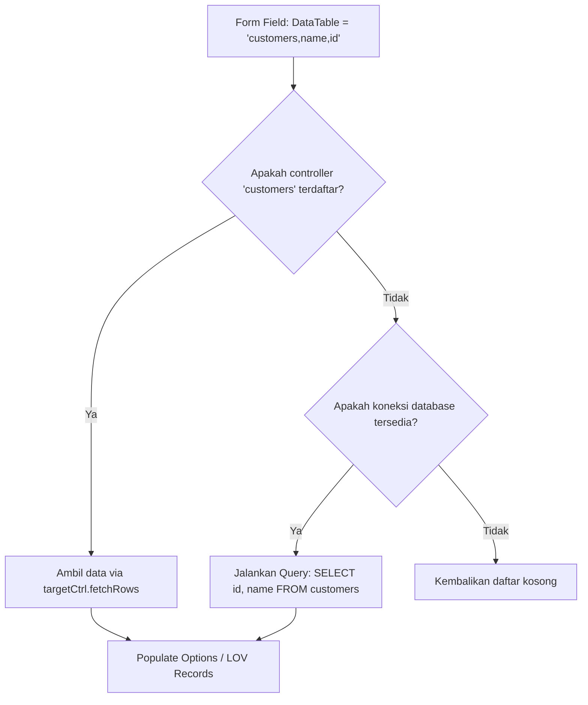

# 🔗 Panduan Relasi Database & Komponen LOV (List of Values) Modal Picker

> **TGo Booster Documentation**  
> Panduan lengkap penggunaan Dynamic Dropdown, Radio Button dari Database, dan Enterprise LOV (List of Values) Modal Picker.

---

## 📌 Daftar Isi
1. [Latar Belakang & Perbandingan](#1-latar-belakang--perbandingan)
2. [Format String `DataTable`](#2-format-string-datatable)
3. [Daftar Method & Komponen](#3-daftar-method--komponen)
   - [AddSelectTable](#a-addselecttable-dynamic-dropdown)
   - [AddRadioTable](#b-addradiotable-dynamic-radio-buttons)
   - [AddLOV (List of Values Modal Picker)](#c-addlov-list-of-values-modal-picker)
4. [Kapan Menggunakan Select vs LOV Modal](#4-kapan-menggunakan-select-vs-lov-modal)
5. [Contoh Implementasi Lengkap (Controller)](#5-contoh-implementasi-lengkap-controller)
6. [Mekanisme Resolusi Data (Memory & SQL Database)](#6-mekanisme-resolusi-data-memory--sql-database)
7. [API Endpoint `/admin/api/lov`](#7-api-endpoint-adminapilov)
8. [Tips & Best Practices](#8-tips--best-practices)

---

## 1. Latar Belakang & Perbandingan

Pada CRUDBooster (PHP Laravel), ketika ingin mengambil opsi dari tabel lain, Anda cukup mendefinisikan properti:
```php
// CRUDBooster (PHP)
$this->form[] = ['label'=>'Kategori','name'=>'category_id','type'=>'select','datatable'=>'categories,name'];
```

Di **TGo Booster (Go)**, Anda tidak perlu lagi menulis slice opsi statis manual seperti:
```go
// ❌ Cara Lama (Hardcode manual):
ctrl.AddSelect("Customer", "customer_id", true, "Pilih...",
    booster.Option{Value: "1", Label: "Budi"},
    booster.Option{Value: "2", Label: "Siti"},
)
```

Sebagai gantinya, gunakan fitur bawaan deklaratif:
```go
// ✅ Cara TGo Booster (Otomatis dari Database / Controller):
ctrl.AddSelectTable("Customer", "customer_id", "customers,name", true, "Pilih customer...")
```

---

## 2. Format String `DataTable`

Format string `DataTable` sangat ringkas dan fleksibel:

$$\text{DataTable} = \text{"table,label\_col[,key\_col]"}$$

| Komponen | Status | Default | Keterangan |
|---|---|---|---|
| `table` | **Wajib** | - | Nama tabel tujuan (misal: `customers`, `users`, `categories`) |
| `label_col` | **Opsional** | `"name"` | Kolom yang ditampilkan sebagai teks/nama kepada pengguna |
| `key_col` | **Opsional** | `"id"` | Kolom yang nilainya disimpan ke database (Foreign Key) |

### Contoh-contoh Format:

- `"categories,name"`  
  Mengambil dari tabel `categories`, label dari kolom `name`, dan key disimpan dari kolom `id`.
- `"customers,full_name,id"`  
  Mengambil dari tabel `customers`, menampilkan kolom `full_name`, menyimpan kolom `id`.
- `"customers,name,name"`  
  Jika database Anda menyimpan nama langsung (bukan ID angka), Anda bisa menyamakan `label_col` dan `key_col`.
- `"accounts,account_title,account_code"`  
  Mengambil dari tabel bagan akun (COA) `accounts`, menampilkan `account_title`, menyimpan `account_code`.

---

## 3. Daftar Method & Komponen

### A. `AddSelectTable` (Dynamic Dropdown)
Menampilkan `<select>` HTML standar yang seluruh pilihannya (`<option>`) di-generate secara otomatis saat form create / edit dimuat.

```go
ctrl.AddSelectTable(
    "Kategori Produk",   // Label
    "category_id",       // Nama input form (field di database)
    "categories,name",   // Format datatable: table,label[,key]
    true,                // Wajib diisi (required)
    "Pilih kategori...", // Placeholder (opsional)
)
```

---

### B. `AddRadioTable` (Dynamic Radio Buttons)
Menampilkan daftar pilihan radio button mendatar secara dinamis dari tabel referensi. Cocok untuk data master yang jumlah pilihannya sedikit (misal 2 - 5 data).

```go
ctrl.AddRadioTable(
    "Metode Pembayaran",    // Label
    "payment_method_id",    // Nama input form
    "payment_methods,name", // Format datatable
    true,                   // Wajib diisi (required)
)
```

---

### C. `AddLOV` (List of Values Modal Picker)
Komponen kelas enterprise untuk mencari dan memilih rekaman dari tabel dengan jumlah data sedang hingga ribuan (misal: Pelanggan, Master Barang, Karyawan, Akun COA).

```go
ctrl.AddLOV(
    "Customer",                                   // Label
    "customer_id",                                // Nama input form
    "customers,name",                             // Format datatable: table,label[,key]
    true,                                         // Wajib diisi (required)
    "Klik tombol Cari untuk memilih customer...", // Placeholder
)
```

#### Cara Kerja UI Komponen LOV:
1. **Dua Input Bersamaan**:
   - `<input type="hidden" name="customer_id" id="lov_val_customer_id">`: Menyimpan nilai aktual (ID/Kode) yang dikirim saat submit form.
   - `<input type="text" id="lov_display_customer_id" readonly>`: Menampilkan teks ramah pengguna (*user-friendly label*).
2. **Tombol "Cari..." & Modal**: Mengklik tombol akan membuka modal pencarian modern dengan animasi halus.
3. **Live Search**: Pengguna dapat mengetik di kolom pencarian modal untuk memfilter data seketika (*instant client/server search*).
4. **Pilih Rekaman**: Klik tombol **"Pilih"** pada baris data akan mengisi input secara instan, menutup modal, dan menampilkan konfirmasi toast.
5. **Tombol Clear (✕)**: Memungkinkan pengguna mengosongkan nilai yang sudah dipilih.
6. **Resolusi Otomatis Saat Edit**: Saat form edit dibuka dengan data lama (misal `customer_id = 42`), TGo Booster secara otomatis mencari label pasangannya dari tabel tujuan sehingga kolom teks langsung terisi nama pelanggan tanpa query manual tambahan!

---

## 4. Kapan Menggunakan Select vs LOV Modal

| Kriteria | `AddSelectTable` | `AddLOV` Modal |
|---|---|---|
| **Jumlah Opsi** | Sedikit (< 50 rekaman) | Banyak (50 hingga puluhan ribu rekaman) |
| **Beban Halaman** | Merender seluruh `<option>` di HTML | Sangat ringan, data dimuat secara async on-demand |
| **Pencarian** | Bergantung pada dropdown browser / select2 | Modal besar dengan live search & kolom tabel jelas |
| **Kasus Penggunaan** | Status, Kategori Utama, Cabang, Satuan Unit | Pelanggan, Pemasok, Master Produk, Akun Akuntansi |

---

## 5. Contoh Implementasi Lengkap (Controller)

Berikut adalah contoh modul **Orders Controller** yang mengintegrasikan LOV Customer, Dropdown Pembayaran, dan Radio Tipe Pengiriman:

```go
package controllers

import (
	"github.com/tokalink/tgo-booster"
	"github.com/tokalink/tgo-booster/starter/app/models"
)

func NewAdminOrderController() *booster.Controller {
	ctrl := &booster.Controller{
		Title:        "Orders",
		Table:        "orders",
		Icon:         `<svg width="18" height="18" viewBox="0 0 24 24" fill="none" stroke="currentColor" stroke-width="2"><rect width="20" height="14" x="2" y="7" rx="2"/><path d="M16 21V5a2 2 0 0 0-2-2h-4a2 2 0 0 0-2 2v16"/></svg>`,
		DataProvider: models.OrderRepo,
	}

	// 1. Data Grid Columns
	ctrl.
		AddCol("Order ID", "id", booster.ColText, false, true).
		AddCol("Customer", "customer_name", booster.ColText, true, true).
		AddCol("Total Amount", "total_amount", booster.ColMoney, false, true).
		AddCol("Status", "status", booster.ColBadge, false, false)

	// 2. Form Input Fields
	ctrl.
		// A. Komponen LOV Modal Picker untuk Customer
		AddLOV("Customer", "customer_name", "customers,name,name", true, "Klik Cari untuk memilih customer...").
		
		// B. Form Input Nominal
		AddForm("Total Amount", "total_amount", booster.InputMoney, true, "Rp 0").
		
		// C. Dropdown Dinamis dari Database (misal tabel categories atau payment_methods)
		// AddSelectTable("Metode Bayar", "payment_method_id", "payment_methods,name", true, "Pilih metode...").
		
		// D. Dropdown Statis
		AddSelect("Order Status", "status", true, "Select status...",
			booster.Option{Value: "Processing", Label: "Processing"},
			booster.Option{Value: "In Transit", Label: "In Transit"},
			booster.Option{Value: "Completed", Label: "Completed"},
		)

	// 3. Lifecycle Hooks
	ctrl.HookBeforeAdd = func(c *booster.Context, data map[string]interface{}) error {
		if status, ok := data["status"]; !ok || status == "" {
			data["status"] = "Processing"
		}
		return nil
	}

	return ctrl
}
```

### 5.2 Studi Kasus Akuntansi: Jurnal Umum & Buku Besar (Chart of Accounts / COA)

Dalam modul akuntansi (Jurnal Umum, Kas Masuk/Keluar, Memorial, Buku Besar), penggunaan **LOV sangat mutlak dan ideal** karena:
1. **Ratusan Rekening**: Bagan akun (COA) memiliki ratusan kode akun mulai dari Aktiva (1-xxxx), Kewajiban (2-xxxx), Modal (3-xxxx), Pendapatan (4-xxxx), hingga Beban (5-xxxx/6-xxxx). Dropdown biasa `<select>` akan membuat halaman lambat dan sulit dicari.
2. **Pencarian Dwifungsi**: Akuntan bisa mencari dengan mengetik nomor kode (misal `1110` untuk Kas) maupun nama akun (`BCA`).
3. **Format Display Gabungan**: Tampilan form langsung memperlihatkan kombinasi `[Kode Akun] - [Nama Akun]` secara otomatis.

#### Contoh Controller Jurnal dengan Akun COA:

```go
package controllers

import (
	"github.com/tokalink/tgo-booster"
)

func NewAdminJournalController() *booster.Controller {
	ctrl := &booster.Controller{
		Title: "Jurnal Umum",
		Table: "journal_entries",
		Icon:  `<svg ...></svg>`,
	}

	// 1. Grid Kolom
	ctrl.
		AddCol("No Bukti", "voucher_no", booster.ColText, true, true).
		AddCol("Tanggal", "trans_date", booster.ColDate, false, true).
		AddCol("Kode Akun", "account_code", booster.ColText, true, true).
		AddCol("Keterangan", "description", booster.ColText, false, true).
		AddCol("Debit", "debit", booster.ColMoney, false, true).
		AddCol("Kredit", "credit", booster.ColMoney, false, true)

	// 2. Form Input LOV untuk Akun Perkiraan (COA)
	ctrl.
		AddForm("No Bukti / Voucher", "voucher_no", booster.InputText, true, "JU-2026/001").
		AddForm("Tanggal Transaksi", "trans_date", booster.InputDate, true).

		// Mengambil dari tabel 'accounts', kolom nama='name', kolom key='code', format display='{code} - {name}'
		AddLOVFormatted(
			"Akun Perkiraan (COA)", 
			"account_code", 
			"accounts,name,code", 
			"{code} - {name}", 
			true, 
			"Cari kode akun atau nama perkiraan...",
		).

		AddForm("Keterangan", "description", booster.InputTextarea, false, "Keterangan transaksi jurnal...").
		AddForm("Nominal Debit", "debit", booster.InputMoney, false, "Rp 0").
		AddForm("Nominal Kredit", "credit", booster.InputMoney, false, "Rp 0")

	return ctrl
}
```

> 💡 **Kelebihan di TGo Booster:**
> - Saat tombol **"Cari..."** diklik, header modal otomatis berubah menjadi **Kode** dan **Nama/Keterangan**.
> - Kode akun diberi styling font monospaced yang rapi.
> - Saat baris dipilih, input otomatis terisi format `1110 - Kas di Bank BCA` dan nilai yang dikirim ke server adalah kode akunnya `1110`.
> - Saat membuka form Edit jurnal lama, kode `1110` langsung di-resolve kembali menjadi label `1110 - Kas di Bank BCA`!

---

## 6. Mekanisme Resolusi Data (Memory & SQL Database)

TGo Booster memiliki resolusi relasi bertingkat (*hierarchical resolution*) yang cerdas:



### Membagikan Koneksi Database ke Engine (`SetDB`)
Agar relasi tabel dapat langsung query ke database SQL (meskipun tabel relasi tersebut belum dibuatkan modul Controller di sidebar), cukup hubungkan koneksi database pada `main.go`:

```go
func main() {
    db, _ := models.InitDatabase()

    admin := booster.NewEngine("TGo Enterprise Admin")
    if db != nil {
        admin.SetDB(db) // Shared connection untuk LOV & Dynamic Select
    }

    // Register controllers...
    admin.Register(controllers.NewAdminOrderController())
    admin.Mount(application.Server(), "/admin")
}
```

---

## 7. API Endpoint `/admin/api/lov`

TGo Booster secara otomatis menyediakan REST JSON API terstandarisasi untuk modal LOV:

```http
GET /admin/api/lov?table=customers&label=name&key=id&q=budi
Accept: application/json
```

### Parameter Query:
- `table` *(wajib)*: Nama tabel tujuan
- `label` *(opsional, default: "name")*: Kolom label
- `key` *(opsional, default: "id")*: Kolom primary key
- `q` *(opsional)*: Kata kunci filter pencarian

### Contoh Response JSON:
```json
[
  {
    "id": "1",
    "name": "Budi Cahyono",
    "customer_name": "Budi Cahyono"
  },
  {
    "id": "2",
    "name": "Budi Santoso",
    "customer_name": "Budi Santoso"
  }
]
```

---

## 8. Tips & Best Practices

1. **Foreign Key vs Nama Langsung**:
   - Jika kolom tabel pesanan Anda bertipe `customer_id` (angka integer):  
     Gunakan `"customers,name"` atau `"customers,name,id"`.
   - Jika kolom tabel pesanan Anda menyimpan nama teks `customer_name`:  
     Gunakan `"customers,name,name"`.

2. **Index Database untuk Performa**:
   - Pastikan kolom `label` (misal `name`, `title`) di tabel referensi memiliki index di database agar query pencarian `WHERE name LIKE ?` berjalan di bawah 1 milidetik.

3. **Kombinasi dengan Lifecycle Hooks**:
   - Anda bisa menggunakan `HookBeforeAdd` atau `HookBeforeEdit` untuk memvalidasi apakah ID yang dipilih dari LOV benar-benar aktif atau valid sebelum disimpan.
