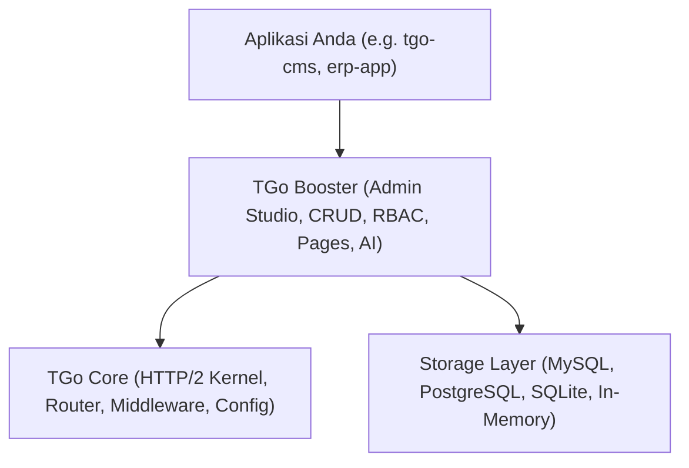

# 🚀 Panduan Membuat Proyek Baru Berbasis TGo Booster

Dokumen ini adalah panduan langkah-demi-langkah (step-by-step guide) bagi developer untuk membangun aplikasi baru (seperti CMS, CRM, ERP, atau SaaS Portal) menggunakan **TGo Booster** sebagai **Framework Dasar (Base Framework / Core Engine)**.

---

## 🏛️ Konsep Arsitektur TGo

Ekosistem TGo dirancang dengan arsitektur berlapis yang ringan, cepat, dan modular:



1. **`tgo-core`**: Kernel router HTTP/2 berperforma tinggi, zero-allocation, session context, dan middleware pipeline.
2. **`tgo-booster`**: Engine platform admin, visual CRUD generator, declarative controllers, HMAC session security, real audit logging, custom pages system, dan AI LLM service studio.
3. **Aplikasi Anda**: Proyek baru Anda (misal `tgo-cms`) yang mengimpor `tgo-booster` sebagai library mandiri tanpa perlu membuat ulang fitur fondasi admin dari nol.

---

## ⚡ CARA INSTAN: 1 Perintah Langsung Jadi (Rekomendasi Utama)

Untuk mencegah salah ketik, konflik port, atau masalah dependensi Go module, gunakan **TGo Booster CLI** atau skrip pembuat proyek instan yang telah disediakan:

### Opsi A. Menggunakan Windows PowerShell (1-Klik):
```powershell
# Jalankan di folder tgo-booster:
.\new-project.ps1 portal-app

# Atau jalankan tanpa parameter untuk wizard interaktif:
.\new-project.ps1
```

### Opsi B. Menggunakan TGo Booster CLI (`booster`):
```bash
# Di folder tgo-booster:
.\booster.exe new portal-app

# Atau via go run langsung:
go run ./cmd/booster new portal-app
```

**Yang otomatis dikerjakan dalam 3 detik tanpa Anda repot:**
1. ✅ Membuat struktur folder MVC (`app/controllers`, `app/models`, `data`, `tmp`).
2. ✅ Mengonfigurasi `go.mod` dengan dependensi yang tepat dan path lokal otomatis.
3. ✅ Membuat `.env` dengan deteksi port bebas (menghindari error `port already in use`).
4. ✅ Menyiapkan database **SQLite mandiri** dengan pembuatan folder otomatis (bebas error `no such file or directory`).
5. ✅ Menyiapkan controller starter CRUD lengkap (`Items & Inventory`).
6. ✅ Mengonfigurasi live hot-reload (`.air.toml`) dan `.gitignore`.
7. ✅ Menjalankan `go mod tidy` dan verifikasi kompilasi otomatis!

Setelah selesai, cukup jalankan:
```bash
cd ..\portal-app
go run main.go
# Atau dengan hot-reload:
air
```

---

## 🛠️ CARA MANUAL: Langkah-demi-Langkah (Bila Ingin Setup Mandiri)

Jika Anda ingin memahami struktur dan membuatnya secara bertahap:

Buka file `go.mod` dan tambahkan dependensi ke `tgo` dan `tgo-booster`. Jika menggunakan local monorepo / sub-folder, Anda dapat menggunakan direktif `replace`:

```go
module github.com/your-org/my-app

go 1.25.3

require (
    github.com/tokalink/tgo v0.1.3
    github.com/tokalink/tgo-booster v0.0.0
)

// Gunakan path lokal jika dalam tahap pengembangan monorepo
replace github.com/tokalink/tgo => ../tgo-core
replace github.com/tokalink/tgo-booster => ../tgo-booster
```

Jalankan `go mod tidy` untuk memverifikasi dependensi.

---

## 📁 Langkah 2: Struktur Direktori Standar (Recommended MVC)

Struktur direktori berikut adalah pola baku yang terbukti andal, bersih, dan mudah dikembangkan untuk jangka panjang:

```text
my-app/
├── .env                     # Konfigurasi environment (DB, Port, AI Key)
├── .air.toml                # Konfigurasi live-reload development
├── go.mod
├── go.sum
├── main.go                  # Entry point aplikasi & mounting engine
├── app/
│   ├── controllers/         # Definisi modul CRUD & custom handler
│   │   ├── admin_article_controller.go
│   │   └── admin_category_controller.go
│   ├── models/              # Entity struct & DataProvider database
│   │   ├── db.go            # Inisialisasi koneksi database (MySQL/SQLite/Postgres)
│   │   └── article.go
│   └── views/               # Template kustom eksternal (.html)
│       └── custom_report.html
├── data/                    # JSON state persisten (users, settings, logs, privileges)
└── public/                  # Static assets & file uploads publik
```

---

## 🗄️ Langkah 3: Konfigurasi Database & Fitur Auto-Migrate

TGo Booster menyediakan abstraksi data `DataProvider` yang independen dari vendor database. Anda dapat menggunakan **In-Memory Store** untuk prototyping cepat atau **SQLStore** untuk database relasional.

### File `app/models/db.go`:

```go
package models

import (
	"database/sql"
	"fmt"
	"log"
	"os"

	_ "github.com/go-sql-driver/mysql"
	_ "github.com/mattn/go-sqlite3"
)

var DB *sql.DB

func InitDatabase() (*sql.DB, error) {
	driver := os.Getenv("DB_DRIVER")
	if driver == "sqlite" || driver == "sqlite3" {
		db, err := sql.Open("sqlite3", "data/app.db")
		if err != nil {
			return nil, err
		}
		DB = db
		return db, nil
	}

	// Default MySQL
	host := os.Getenv("DB_HOST")
	port := os.Getenv("DB_PORT")
	user := os.Getenv("DB_USERNAME")
	pass := os.Getenv("DB_PASSWORD")
	dbName := os.Getenv("DB_DATABASE")

	dsn := fmt.Sprintf("%s:%s@tcp(%s:%s)/%s?parseTime=true", user, pass, host, port, dbName)
	db, err := sql.Open("mysql", dsn)
	if err != nil {
		log.Printf("⚠️ Gagal konek MySQL: %v. Fallback ke MemoryStore.", err)
		return nil, err
	}
	DB = db
	return db, nil
}
```

### ⚡ Fitur Auto-Migrate Skema Tabel Otomatis
Dengan TGo Booster, Anda **tidak perlu lagi menulis file SQL DDL (`CREATE TABLE ...`) secara manual**. Engine akan membaca definisi form controller Anda dan otomatis membuat tabel SQL yang sesuai:

```go
// Menjalankan auto-migrate pada satu controller
articleCtrl.AutoMigrate()

// ATAU menjalankan auto-migrate ke seluruh controller yang terdaftar
admin.AutoMigrateAll()
```

---

## 🎮 Langkah 4: Membuat Modul CRUD & Controller

Buat file controller deklaratif di `app/controllers/admin_article_controller.go`:

```go
package controllers

import (
	booster "github.com/tokalink/tgo-booster"
	"github.com/your-org/my-app/app/models"
)

func NewAdminArticleController() *booster.Controller {
	// 1. Inisialisasi controller dan bind dengan SQLStore
	ctrl := &booster.Controller{
		Title: "Articles",
		Table: "articles",
		Icon:  `<svg width="18" height="18" viewBox="0 0 24 24" fill="none" stroke="currentColor" stroke-width="2"><path d="M14 2H6a2 2 0 0 0-2 2v16a2 2 0 0 0 2 2h12a2 2 0 0 0 2-2V8z"/><polyline points="14 2 14 8 20 8"/></svg>`,
	}

	if models.DB != nil {
		ctrl.DataProvider = booster.NewSQLStore(models.DB, "articles", "id")
	} else {
		ctrl.DataProvider = booster.NewMemoryStore()
	}

	// 2. Kolom Tabel Data Grid
	ctrl.
		AddCol("ID", "id", booster.ColText, false, true).
		AddCol("Title", "title", booster.ColText, true, true).
		AddCol("Category", "category_id", booster.ColText, true, false).
		AddCol("Views", "views", booster.ColNumber, false, true).
		AddCol("Status", "status", booster.ColBadge, false, false)

	// 3. Form Input Data
	ctrl.
		AddForm("Article Title", "title", booster.InputText, true, "Enter article title...").
		AddForm("Slug URL", "slug", booster.InputText, false, "auto-generated-slug").
		AddForm("Category", "category_id", booster.InputSelect, true, "Select category...").
		AddForm("Content", "content", booster.InputWYSIWYG, false, "Write article content...").
		AddForm("Views", "views", booster.InputNumber, false, "0").
		AddSelect("Status", "status", true, "Select status...",
			booster.Option{Value: "Published", Label: "Published"},
			booster.Option{Value: "Draft", Label: "Draft"},
			booster.Option{Value: "Archived", Label: "Archived"},
		)

	// Relasi Dinamis (Foreign Key Dropdown)
	// Otomatis menarik nama category dari tabel 'categories'
	ctrl.Forms[2].DataTable = "categories,name,id"

	// 4. Executive KPI Widgets di atas tabel
	ctrl.AddWidget(booster.WidgetCard{
		Title:     "Total Articles",
		Value:     "128 Posts",
		Subtext:   "Active published content",
		Trend:     "+12.4%",
		TrendType: "positive",
		Color:     "blue",
		ColSpan:   4,
	})

	// 5. Lifecycle Hooks untuk Business Logic Kustom
	ctrl.HookBeforeAdd = func(c *booster.Context, data map[string]interface{}) error {
		// Logika validasi atau manipulasi data sebelum disimpan
		if data["views"] == nil || data["views"] == "" {
			data["views"] = 0
		}
		return nil
	}

	return ctrl
}
```

---

## 📄 Langkah 5: Custom Pages & Template HTML Eksternal

Jika Anda ingin halaman khusus dengan tampilan non-tabel (misal Analytics Dashboard, Custom Report, atau Wizard), Anda dapat menggunakan **`RenderViewFile`** atau **`AddCustomPageWithFile`**:

```go
// Menambahkan halaman standalone khusus di sidebar admin
admin.AddCustomPageWithFile(
    "/reports/traffic", 
    "Traffic Analytics", 
    `<svg width="18" height="18" viewBox="0 0 24 24" fill="none" stroke="currentColor" stroke-width="2"><path d="M3 3v18h18"/></svg>`, 
    "app/views/traffic.html", 
    func(r *http.Request) interface{} {
        // Data yang di-passing ke file template HTML
        return map[string]interface{}{
            "TotalVisitors": "142,500",
            "TopSource": "Google Search (62%)",
        }
    }, 
    true, // Tambahkan ke menu navigasi sidebar
)
```

> [!TIP]
> **Hot-Reloading View**: File template HTML eksternal mendeteksi perubahan timestamp (`ModTime`) secara otomatis saat development, sehingga Anda tidak perlu me-restart server setiap kali mengedit file `.html`.

---

## 🚪 Langkah 6: Entry Point `main.go`

Hubungkan seluruh komponen di dalam file `main.go`:

```go
package main

import (
	"log"
	"net/http"

	"github.com/tokalink/tgo/pkg/app"
	booster "github.com/tokalink/tgo-booster"
	"github.com/your-org/my-app/app/controllers"
	"github.com/your-org/my-app/app/models"
)

func main() {
	// 1. Inisialisasi Database
	db, _ := models.InitDatabase()

	// 2. Inisialisasi HTTP Server TGo
	application := app.New().SetAddr(":8080")

	// 3. Inisialisasi TGo Booster Engine
	admin := booster.NewEngine("Enterprise CMS Platform")
	if db != nil {
		admin.SetDB(db)
	}

	// 4. Daftarkan Controller
	articleCtrl := controllers.NewAdminArticleController()
	admin.Register(articleCtrl)

	// 5. Eksekusi Auto-Migrate Skema Database
	if err := admin.AutoMigrateAll(); err != nil {
		log.Printf("⚠️ Auto-migrate notice: %v", err)
	}

	// 6. Mount Admin Studio Console ke /admin
	admin.Mount(application.Server(), "/admin")

	// 7. Route Root (/): Melayani Halaman Landing/CMS Studio
	application.Server().Register("/", http.HandlerFunc(func(w http.ResponseWriter, r *http.Request) {
		if r.URL.Path == "/" || r.URL.Path == "" {
			if admin.ServePublicPage(w, r) {
				return
			}
		}
		http.Redirect(w, r, "/admin", http.StatusSeeOther)
	}))

	log.Println("=========================================================")
	log.Println("⚡ [TGo App] Server running on http://localhost:8080")
	log.Println("   ├─ Public Website: http://localhost:8080/")
	log.Println("   ├─ Admin Console:  http://localhost:8080/admin")
	log.Println("   ├─ Default Login:  admin@tgo.io")
	log.Println("   └─ Default Pass:   admin123")
	log.Println("=========================================================")

	if err := application.Run(); err != nil {
		log.Fatalf("Server error: %v", err)
	}
}
```

---

## 🔒 Langkah 7: Keamanan & Hak Akses (RBAC)

Secara default, TGo Booster langsung mengaktifkan sistem keamanan bawaan:
- **Default Superadmin**: `admin@tgo.io` (password default: `admin123`).
- **Session Protection**: Cookie `cb_session_token` ditandatangani dengan algoritma **HMAC-SHA256**.
- **Role Permissions**: Diatur secara visual di menu **Privileges & Roles** (`/admin/privileges`) untuk membatasi akses `CanAccess`, `CanCreate`, `CanEdit`, dan `CanDelete` per-modul.
- **Audit Logging**: Setiap aksi create, update, delete, login, dan switch role terekam otomatis di `/admin/logs`.

---

## 🤖 Langkah 8: Mengaktifkan AI Page Generator

TGo Booster dilengkapi studio pembuatan landing page otomatis berbasis AI:
1. Masuk ke menu **Settings** (`/admin/settings`) &rarr; Tab **AI & LLM Services**.
2. Masukkan Host LLM Anda (contoh: `https://ai.sumopod.com` atau `https://api.openai.com`) dan API Secret Key.
3. Klik tombol **`🔄 Auto-Get Server Models`** untuk menarik daftar model aktif dari server secara otomatis.
4. Buka menu **Custom Pages** (`/admin/pages`), klik tombol **`✨ AI Page Generator`**, dan ketik deskripsi halaman yang Anda inginkan. Halaman landing page modern dengan layout responsif, semantic HTML, dan SEO Meta Tag akan disintesis secara instan.

---

## 🚀 Langkah 9: Menjalankan Aplikasi & Deployment

### Mode Development (Hot-Reload dengan `air`):
Simpan file `.air.toml` di root proyek:
```toml
root = "."
tmp_dir = "tmp"

[build]
cmd = "go build -o ./tmp/app.exe ."
bin = "./tmp/app.exe"
include_ext = ["go", "html", "env"]
exclude_dir = ["data", "tmp", "public"]
```
Jalankan:
```bash
air
```

### Mode Production (Single Binary Embed):
Aplikasi Go dapat dikompilasi menjadi satu file binary mandiri (single binary):
```bash
go build -ldflags="-s -w" -o my-app.exe .
```
Semua template HTML, CSS, JavaScript, dan library booster sudah tertanam rapi di dalam binary tanpa memerlukan dependensi eksternal!
